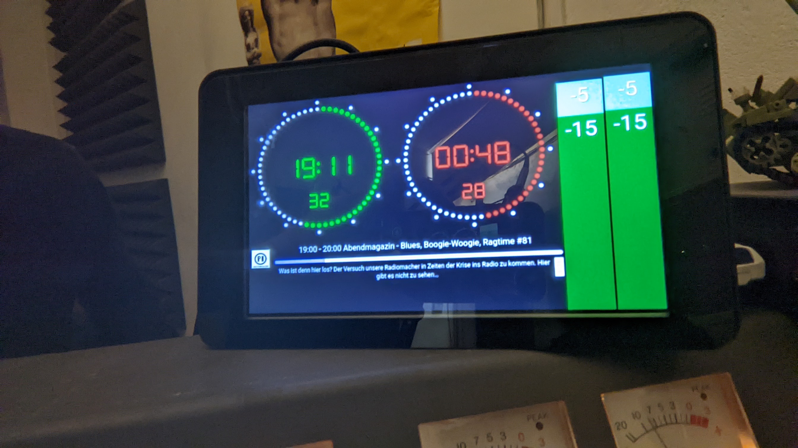

# Studio Dashboard

For our radio studio, we need a clock to show the current time, how long the current show has been running, and what show comes next. Additionally, we need the peak and RMS levels of the recorded signal to avoid audio being too loud or too quiet.

For the frontend, we use a Raspberry Pi with a display that can be placed on top of the mixer. On boot, it starts a full-screen browser with the page from the GUI server.

The GUI server shows a webpage and requests level status from the audio server.

A Liquidsoap instance records the signal from the radio station's audio mixer and writes peak and RMS levels into a log. On the same machine, an audio server process runs, displaying the current values from the log as JSON data.

The Raspberry Pi with display was sponsored by the MABB in 2022.
